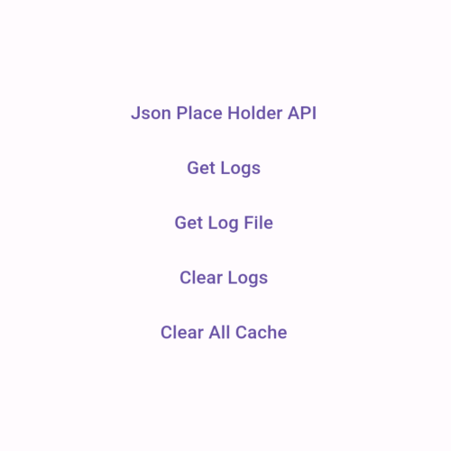

# King Cache

This package is used to cache apis results so next time when you call the same api, it will return the cached result instead of calling the api again. This will help to reduce the number of api calls and improve the user experience of your app.

This package uses file based caching system.

It give you couple of functions to manage the cache.
It also have a log function so you can add, remove, clear and share logs.
It also give you ability to set the cache expiry time.

## Features


1. Cache api results.
2. Set cache expiry time.
3. Manage cache.
4. Log cache.
5. Clear cache.
6. Share cache.

## Getting started

1. Add this package to your pubspec.yaml file.
2. Import the package.
3. Call the functions.

## Usage

```dart
TextButton(
    onPressed: () async {
    KingCache.storeLog('Call Json Place Holder API');
    await KingCache.storeCacheViaRest(
        'https://jsonplaceholder.typicode.com/todos/1',
        method: HttpMethod.get,
        onSuccess: (data) {
        // This will execute 2 times when you have data in data
        debugPrint(data);
        KingCache.storeLog('Response: $data');
        },
        shouldUpdate: true,
        expiryTime: DateTime.now().add(const Duration(seconds: 10)),
    );
    KingCache.storeLog('Call Json Place Holder API');
    },
    child: const Text('Json Place Holder API'),
)
```
```dart
TextButton(
    onPressed: () async {
    debugPrint(await KingCache.getLog);
    },
    child: const Text('Get Logs'),
)```
```dart
TextButton(
    onPressed: () => KingCache.shareLogs,
    child: const Text('Share Logs'),
)```
```dart
TextButton(
    onPressed: () => KingCache.clearLog,
    child: const Text('Clear Logs'),
)```
```dart
TextButton(
    onPressed: () => KingCache.clearAllCache,
    child: const Text('Clear All Cache'),
)
```

## Additional information

If you have any questions or suggestions, please feel free to contact us at [King Technologies](https://kingtechnologies.dev/).

Please file [GitHub Issues](https://github.com/king-technologies/king_cache/issues)
for bugs and feature requests.

You can expect responsive replies and fast fixes to any issues that appear.

## License

```
MIT License
```